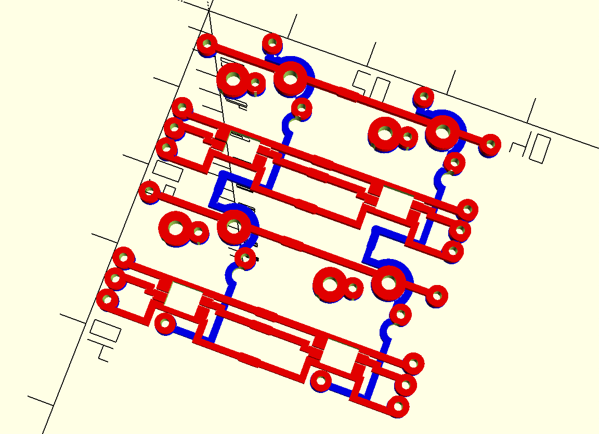

# OpenSCAD Keyboard Library

This library can be used to generate keyboard cases and plates using a
centralized layout.

# Obligatory Notice:

While this project is intended for modeling physical parts, those parts may or may not actually
fit together. This library does a lot of different things and you probably want to pull up your
models in some kind of renderer and check that everything fits together as you expect before you
have something physically manufactured.

## *Caution: Unstable API*

Note that this is still a work in progress and apis should be considered UNSTABLE until the %"1.0.0"
release. I expect that release to be relatively soon, but who knows! That milestone includes issues
that I think could impact the current api.

## Adding this library to your existing project

### As a Git Submodule

My personal preference is using this as a git submodule. This allows you to get updates as
they're available.

```sh
$ git submodule add https://gitlab.com/alexives/keyboard_lib.git
```

Then you can reference it with

```
use <keyboard_lib/keyboard.scad>
```

### As a single file

You can download the latest compiled release from [the project releases page](https://gitlab.com/alexives/keyboard_lib/-/releases)

Then you would reference it as

```
use <keyboard_lib.{version}.scad>
```

## Crafting Layouts

Say you wanted a keyboard with a spacebar, a shift key, and 4 regular keys.

### Simple Example

You would write a layout like this:
```
layout = [
  [[6.26]],
  [[2.25],[],[],[],[]]
];
```

Then, you could generate a plate using:
```
top_plate(layout);
```


And a top case using:
```
top_case(layout);
```


Or a single piece case:
```
board(layout);
```


And a bottom piece:
```
bottom_case(layout);
```


#### Main Array
A layout is an array of rows `layout = [<row>, <row>, <row>]`. A single
row is assumed to be in a line.

#### Rows Array
A row is made up of keys like `row=[<key>, <key>, <key>, <key>]`. Each
key is relative to the key that precedes it. So if a key is lowered by
0.25u, the next key will be in line with it.

#### Keys Array
A key is made up of information about it's size and position. Like
`key=[<width>,<xpos>,<ypos>,<rotation>,<pcb options>]`.

#### Rotation Array
A rotation array is made up of information about where to rotate from and
how much to rotate. Like `rotate=[<angle degrees>, <x offset>, <y offset>]`
The x and y offset is based on the top right corner of the key, and the
rotation is clockwise when looking at the top of the board.

#### PCB Options

**Caution: This is an expermental feature and support for keys larger 1u is currently limited.**

The PCB options are used to controll connections among the array of keys
like `[<top>,<bottom>,<left>,<right>]`. Each can be specified as one of
`hole`, `connect`, or `none`.

For example, the following layout:

```
layout = [
  [[1,0,0,[],["hole","connect","connect","hole"]],[1,0,0,[],["hole","connect","hole","connect"]]],
  [[1,0,0,[],["connect","hole","connect","hole"]],[1,0,0,[],["connect","hole","hole","connect"]]]
];
```

Would produce the following connected traces:


#### More Detailed Examples

So, if you wanted to have a layout with a space bar, a shift key,
and a single ctrl modifier at the other end that would look something
like:

```
use <keyboard_lib/keyboard.scad>
layout = [
  [[6.25]], // Single space bar
  [[2.25], [1.25, 2.75]]
];
board(layout, depth=7, radius=3);
```

Which would render something like:


Or if you wanted a super nifty looking directional pad, you could do something like:
```
use <keyboard_lib/keyboard.scad>
layout = [
  [[],[1,0.25,0.25],[1,0.25,-0.25]],
  [[1,0.25,0.25],[],[]],
  [[1,0,0.5],[1,0.25,-0.25],[1,0.25,0.25]]
];
board(layout, depth=7, radius=3);
```

Which would render something like:


Or if you wanted a key with a little spin to it (Rotated keys), you could do something like:
```
use <keyboard_lib/keyboard.scad>
layout = [[
          [1,0,0,[15,0,-1]],
          [1,0.05,0,[25,0,-1]],
          [1,0.1,0,[35,0,-1]],
          [1,0.2,0,[45,0,-1]]
        ]];
board(layout, depth=5, radius=10)
  // We'll visit what this case is doing below, suffice to say for now auto-generated cases
  // don't work well with rotation.
  translate([-u_mm(0.1),-u_mm(0.3)])
    square([u_mm(5),u_mm(2)]);
```

Which would render something like:


### Cases

There are 2 options for cases, you can either generate them automatically in which case they're just
a box, or you can define your own shape as a child of the given function. This should be a 2d shape,
not a solid. The examples above use generated box cases, but sometimes you want something with a
little more shape to it.

So, something like:
```
layout = [
  [[],[]],
  [[],[]]
];
board(layout, depth=6)
  translate([u_mm(1),u_mm(1),0])
    circle(d=u_mm(3));
```

Which would render something like:


### Circuits

Circuits is the term we use for a generic other piece of hardware. So it could be a pro micro, or
it could be a TRRS jack, or maybe someday it could be a raspberry pi pico! This allows you to place
one or several daughter circuits on the PCB for easy wiring and stability.

Like layouts, circuit arguements are an array of arrays, like:

```
circuits = [
  [2,4,0,0,"pro_micro"],
  [2,5,0,0,"trrs"]
]
```

The outer array contains the inner array of circuits. Each sub array consists of:

```
[
  X position in key Units,
  Y position in key Units,
  Z position in mm,
  Rotation from bottom left corner,
  [Circuit Slug](#circuit-types),
  circuit specific parameters...
]
```

#### Circuit Types

| Name                | Slug           | Description                                                                                                  |
|---------------------|----------------|--------------------------------------------------------------------------------------------------------------|
| Pro Micro           | pro_micro      | Standard microcontroller Arduino Pro Micro footprint. This can be used for any compatible boards.            |
| TRRS (Left)         | trrs_left      | TRRS (4 pin audio) connector. This version has exposed pins on the left side of the plug.                    |
| TRRS (Right)        | trrs_right     | TRRS (4 pin audio) connector. This version has exposed pins on the right side of the plug.                   |
| Proton C            | proton_c       | This is the Proton C footprint for the full length proton C.                                                 |
| Proton C (Snapped)  | proton_c_short | This is a variation of the pro micro footprint with extra pins for the proton c that has been snapped off.   |
| EC11 Rotary Encoder | ec11           | The EC11 rotary encoder is nice for things like volume knobs and is qmk compatible (rotate, press)           |
| EC11 Rotary Encoder | ec11_double    | Same as EC11, but for 2 sided pcbs                                                                           |
| MTS-101 Toggle      | mts_101        | The MTS-101 is a toggle switch. It's sturdy enough to be surface mounted, but is best mounted to a case.     |
| Manual Trace        | manual_trace   | The manual trace circuit is used to connect traces in the specification file. [See details](#manual-traces). |

#### Supported boards

- *Arduino Pro Micro* This includes the Elite C, or the Proton C without the extended 
  back. Also the Qwiic Pro Micro would work here.
- *TRRS* This is intended for a PJ-320A type TRRS jack.

#### Manual Traces

Manual traces are a special circuit that is used to connect other circuits without having to hand wire after milling. The circuit is defined a little differently than the others, [x, y, z, rotation, "manual_trace", <path vector>, <side>, <ends>] for example:

```
[0, 0, 0, 0, "manual_trace", [[0,0],[0,10]], "top", "none", width]
```

This would make a trace in the top left of the keyboard going over 10 centimeters. The vector is converted to a .8mm trace.

The vector is simply a series of points that are used to make the line.

Side is either `"top"`, `"bottom"`, or `"both"`. That determines what side of the PCB the trace is created on.

Ends defines what you want the ends to do. `"none"` will have blank ends, `"holes"` will put through holes at each end, `"hole_begin"`
will put a hole only at the beginning of the trace, `"hole_end"` will put a through hole at the end of the trace.

### More Examples

- [60% Layout](/examples/60_percent.scad)
- [Let's Split](/examples/lets_split.scad)
- [Stabilizer Tester](/examples/stabilizer_macro_pad/)
- [Circular Macropad](/examples/circle_macropad.scad)

## Modules

### `board(layout, style="mx", margin=5, thickness=5, cnc=false, depth=0, radius=0, circuits=[], inner_height=0) { children }`

Generates a keyboard case with an integrated plate and no bottom, suitable for 3d printing.

| Argument    | Description                                                      | Default  |
| ----------- | ---------------------------------------------------------------- | -------- |
| layout      | layout of rows and keys, see [Layouts](#layouts)                 | Required |
| circuits    | layout of non switch components, see [circuits](#circuits)       | None     |
| style       | the kind of switches (mx, ect)                                   | mx       |
| margin      | Amount of space around the edge of the keyboard                  | 5mm      |
| thickness   | Extra height added to bottom of keyboard                         | 5mm      |
| depth       | How deep the keys should sit below the top of the keyboard       | None     |
| radius      | The corner radius of the keyboard exterior sides                 | None     |
| children    | Optionally accepts 2d children for projecting cases              | None     |

Example:
```
layout = [
  [[],[]],
  [[],[]]
];
board(layout, depth=6)
  translate([u_mm(1),u_mm(1),0])
    circle(d=u_mm(3));
```


### `top_plate(layout, style="mx", margin=-0.5, cnc=true, thickness=1.5, circuits=[]) { children }`

Generates a plate solid. If cnc=true (the default), it will add holes in the corners and
round other edges to make it easier to CNC.

| Argument    | Description                                                      | Default  |
| ----------- | ---------------------------------------------------------------- | -------- |
| layout      | layout of rows and keys, see [Layouts](#layouts)                 | Required |
| circuits    | layout of non switch components, see [circuits](#circuits)       | None     |
| style       | the kind of switches (mx, ect)                                   | mx       |
| thickness   | Extra height added to bottom of keyboard                         | 1.5mm    |
| margin      | Amount of space around the edge of the keyboard                  | -0.5mm   |
| cnc         | If the board is going to a cnc router/mill (assumes 1/16" bit)   | True     |
| children    | Optionally accepts 2d children for projecting cases              | None     |

Example:
```
layout = [
  [[],[]],
  [[],[]]
];
top_plate(layout)
  translate([u_mm(1),u_mm(1),0])
    circle(d=u_mm(3));
```


### `top_plate_drawing(layout, style="mx", margin=0, cnc=true, circuits=[]) { children }`

Generates a plate drawing for export to a CNC. If cnc=true (the default), it will add
holes in the corners and round other edges to make it easier to CNC.

| Argument    | Description                                                      | Default  |
| ----------- | ---------------------------------------------------------------- | -------- |
| layout      | layout of rows and keys, see [Layouts](#layouts)                 | Required |
| circuits    | layout of non switch components, see [circuits](#circuits)       | None     |
| style       | the kind of switches (mx, ect)                                   | mx       |
| margin      | Amount of space around the edge of the keyboard                  | 0mm      |
| cnc         | If the board is going to a cnc router/mill (assumes 1/16" bit)   | True     |
| children    | Optionally accepts 2d children for projecting cases              | None     |

Example:
```
layout = [
  [[],[]],
  [[],[]]
];
top_plate_drawing(layout)
  translate([u_mm(1),u_mm(1),0])
    circle(d=u_mm(3));
```


### `top_case(layout, style="mx", margin=5, thickness=10, depth=0, radius=0, circuits=[]) { children }`

Generates a case without an integrated plate as a solid for 3d printing or milling.
Intended for use with top_plate or other 1.5mm plate.

| Argument    | Description                                                      | Default  |
| ----------- | ---------------------------------------------------------------- | -------- |
| layout      | layout of rows and keys, see [Layouts](#layouts)                 | Required |
| circuits    | layout of non switch components, see [circuits](#circuits)       | None     |
| style       | the kind of switches (mx, ect)                                   | mx       |
| margin      | Amount of space around the edge of the keyboard                  | 5mm      |
| thickness   | Extra height added to bottom of keyboard                         | 5mm      |
| depth       | How deep the keys should sit below the top of the keyboard       | None     |
| radius      | The corner radius of the keyboard exterior sides                 | None     |
| children    | Optionally accepts 2d children for projecting cases              | None     |

Example:
```
layout = [
  [[],[]],
  [[],[]]
];
top_case(layout, depth=6)
  translate([u_mm(1),u_mm(1),0])
    circle(d=u_mm(3));
```


### `bottom_case(layout, style="mx", plate=1.5, margin=5, thickness=5, radius=0, circuits=[]) { children }`

Generates the bottom part of a case as a solid for 3d printing or milling. Suitable
for use as the bottom half with either the top_case or board models.

| Argument    | Description                                                      | Default  |
| ----------- | ---------------------------------------------------------------- | -------- |
| layout      | layout of rows and keys, see [Layouts](#layouts)                 | Required |
| circuits    | layout of non switch components, see [circuits](#circuits)       | None     |
| plate       | How thick is the plate being used. Can also specify "board"      | 1.5mm    |
| style       | the kind of switches (mx, ect)                                   | mx       |
| margin      | Amount of space around the edge of the keyboard                  | 5mm      |
| thickness   | Extra height added to bottom of keyboard                         | 5mm      |
| depth       | How deep the keys should sit below the top of the keyboard       | None     |
| radius      | The corner radius of the keyboard exterior sides                 | None     |
| children    | Optionally accepts 2d children for projecting cases              | None     |

Example:
```
layout = [
  [[],[]],
  [[],[]]
];
bottom_case(layout, depth=6)
  translate([u_mm(1),u_mm(1),0])
    circle(d=u_mm(3));
```


### `pcb_traces(layout, style="mx", rgb=true, slices=1, circuits=[])`

Generates traces for each key/switch to aid hand wiring (single sided)
This is a drawing so it should be used to generate either a dxf or svg

| Argument    | Description                                                      | Default  |
| ----------- | ---------------------------------------------------------------- | -------- |
| layout      | layout of rows and keys, see [Layouts](#layouts)                 | Required |
| circuits    | layout of non switch components, see [circuits](#circuits)       | None     |
| style       | the kind of switches (mx, ect)                                   | mx       |
| slices      | adds paths around the outside of the circuit                     | 1        |
| rgb         | If supported, add RGB-Led circuits under the switch              | true     |

Example:
```
layout = [
  [[],[]],
  [[],[]]
];
pcb_traces(layout);
```


### `pcb_traces_top(layout, style="mx", rgb=true, slices=1, circuits=[])`

Generates traces for each key/switch to aid hand wiring (top of double sided)
This is a drawing so it should be used to generate either a dxf or svg

| Argument    | Description                                                      | Default  |
| ----------- | ---------------------------------------------------------------- | -------- |
| layout      | layout of rows and keys, see [Layouts](#layouts)                 | Required |
| circuits    | layout of non switch components, see [circuits](#circuits)       | None     |
| style       | the kind of switches (mx, ect)                                   | mx       |
| slices      | adds paths around the outside of the circuit                     | 1        |
| rgb         | If supported, add RGB-Led circuits under the switch              | true     |

Example:
```
layout = [
  [[],[]],
  [[],[]]
];
pcb_traces_top(layout);
```


### `pcb_traces_bottom(layout, style="mx", rgb=true, slices=1, circuits=[])`

Generates traces for each key/switch to aid hand wiring (bottom of double sided)
This is a drawing so it should be used to generate either a dxf or svg

| Argument    | Description                                                      | Default  |
| ----------- | ---------------------------------------------------------------- | -------- |
| layout      | layout of rows and keys, see [Layouts](#layouts)                 | Required |
| circuits    | layout of non switch components, see [circuits](#circuits)       | None     |
| style       | the kind of switches (mx, ect)                                   | mx       |
| slices      | adds paths around the outside of the circuit                     | 1        |
| rgb         | If supported, add RGB-Led circuits under the switch              | true     |

Example:
```
layout = [
  [[],[]],
  [[],[]]
];
pcb_traces_bottom(layout);
```


### `pcb_drill(layout, style="mx", rgb=true, circuits=[], single=true)`

Generates pcbs drill location under each key/switch to for the pcb
This is a drawing so it should be used to generate either a dxf or svg

| Argument    | Description                                                      | Default  |
| ----------- | ---------------------------------------------------------------- | -------- |
| layout      | layout of rows and keys, see [Layouts](#layouts)                 | Required |
| circuits    | layout of non switch components, see [circuits](#circuits)       | None     |
| style       | the kind of switches (mx, ect)                                   | mx       |
| single      | designate a single or double sided board where supported         | true     |
| rgb         | If supported, add RGB-Led circuits under the switch              | true     |

Example:
```
layout = [
  [[],[]],
  [[],[]]
];
pcb_drill(layout);
```


### `pcb_outline(layout, style="mx", circuits=[]) { children }`

Generates the pcb outline so that you can mill the outside edge
This is a drawing so it should be used to generate either a dxf or svg

| Argument    | Description                                                      | Default  |
| ----------- | ---------------------------------------------------------------- | -------- |
| layout      | layout of rows and keys, see [Layouts](#layouts)                 | Required |
| circuits    | layout of non switch components, see [circuits](#circuits)       | None     |
| style       | the kind of switches (mx, ect)                                   | mx       |

Example:
```
layout = [
  [[],[]],
  [[],[]]
];
pcb_outline(layout, depth=6)
  translate([u_mm(1),u_mm(1),0])
    circle(d=u_mm(3));
```


### `part(type, layout, style="mx", rgb=true, cnc=false, margin=5, depth=0, thickness=5, radius=0, circuits=[])`

Generic function for generating models that takes an argument for part
type. Useful when the part is used in a function, allowing for different
parts to be swapped out

| Argument    | Description                                                      | Default  |
| ----------- | ---------------------------------------------------------------- | -------- |
| layout      | layout of rows and keys, see [Layouts](#layouts)                 | Required |
| circuits    | layout of non switch components, see [circuits](#circuits)       | None     |
| plate       | How thick is the plate being used. Can also specify "board"      | 1.5mm    |
| cnc         | If the board is going to a cnc router/mill (assumes 1/16" bit)   | True     |
| style       | the kind of switches (mx, ect)                                   | mx       |
| margin      | Amount of space around the edge of the keyboard                  | 5mm      |
| thickness   | Extra height added to bottom of keyboard                         | 5mm      |
| depth       | How deep the keys should sit below the top of the keyboard       | None     |
| radius      | The corner radius of the keyboard exterior sides                 | None     |
| children    | Optionally accepts 2d children for projecting cases              | None     |
| rgb         | If supported, add RGB-Led circuits under the switch              | true     |

Example:

```
layout = [
  [[],[]],
  [[],[]]
];
part('pcb_outline', layout, depth=6)
  translate([u_mm(1),u_mm(1),0])
    circle(d=u_mm(3));
```

## Functions

### `u_mm(units)`

Used to convert from "key units" (1u = standard key width) to millimeters

| Argument | Description                      | Default  |
| -------- | -------------------------------- | -------- |
| units    | number of keys (height or width) | Required |

# Development

Linting is done with `sca2d`, currently, warnings are ignored but errors are failures. That said, if you add a bunch of warnings that's annoying.

Tests are done with a tool called `openspecad`. This works in two different ways:
- If a test is for functions, it's labeled at the top and uses assertions
- All other tests are snapshot tests that capture what a fixture looks like at a point in time

## Running tests

Tests are run automatically in gitlab ci, but can (and should) also be run locally. This can
be done by either calling `./bin/openspecad` on a file or folder directly, or if you'd like
you can call a make target with the name of the file you'd like to run.

## Function tests

These are pretty straight forward. If you add or modify a function, add some assertions that
should fail if something is wrong. If the assertions fail, the tests should fail.

Function tests 

## Snapshot tests

All of the other tests are snapshot tests. The idea is that most fixtures shouldn't change
with a given code change. SO, when you add new code to generate new things, you should add
fixtures that capture what that looks like. If you're just adding new options, the existing
fixtures SHOULD NOT CHANGE. And, if they do, you should review that change manually to
ensure that change won't be upsetting to folks.

There are currently 2 categories of snapshot tests:
- Feature: These are little keyboards that exercise a bunch of features exclusively through `keyboard.scad`
- Modules: These are focused on individual modules and do not use the top level `keyboard.scad` file.

# Releasing

New releases are created by pushing a new version tag to the repository.
The new tag is automatically built into a new package and released.

# [License - MIT](/LICENSE.md)

# Credits

- Stabilizer dimensions are based [on the ones in this swill/kad github issue](https://github.com/swill/kad/issues/14#issuecomment-538500178)
- Layouts are heavily inspired by [Keyboard Layout Editor](keyboard-layout-editor.com/), with hope to someday support that format.
